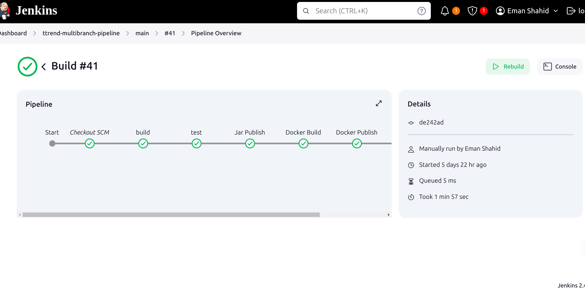
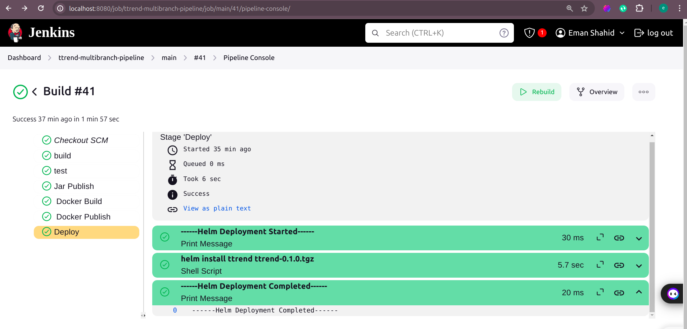
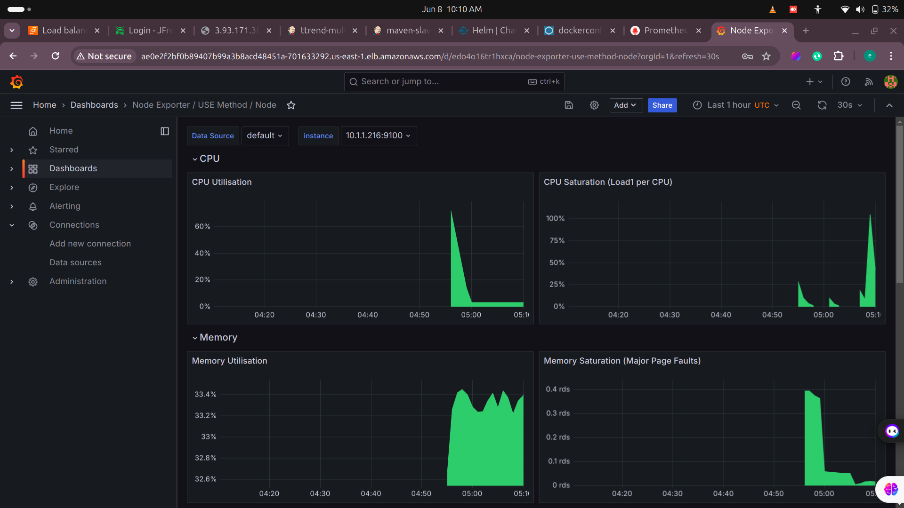

# DevOps Pipeline Automation 

This repository contains a comprehensive DevOps pipeline project utilizing Jenkins, Docker, JFrog Artifactory, Prometheus, Grafana, Ansible, Terraform, and Kubernetes. The project covers infrastructure provisioning, CI/CD automation, containerization, deployment, and monitoring.

## Table of Contents
1. [Setting up Terraform](#setting-up-terraform)
2. [Provisioning Jenkins and Ansible](#provisioning-jenkins-and-ansible)
3. [Configuring Ansible](#configuring-ansible)
4. [Jenkins Pipeline Job](#jenkins-pipeline-job)
5. [Developing a Jenkinsfile from Scratch](#developing-a-jenkinsfile-from-scratch)
6. [Multibranch Pipeline](#multibranch-pipeline)
7. [GitHub Webhooks](#github-webhooks)
8. [SonarQube Configuration](#sonarqube-configuration)
9. [Executing SonarQube Analysis](#executing-sonarqube-analysis)
10. [Docker and Artifactory](#docker-and-artifactory)
11. [Kubernetes Cluster Provisioning](#kubernetes-cluster-provisioning)
12. [Helm for Kubernetes](#helm-for-kubernetes)
13. [Monitoring with Prometheus and Grafana](#monitoring-with-prometheus-and-grafana)
14. [Output](#output)

## Setting up Terraform
To facilitate infrastructure provisioning, start by setting up Terraform:

1. Install Terraform from the [official website](https://www.terraform.io/downloads.html).
2. Create a Terraform configuration file (`main.tf`) to define the required infrastructure.

## Provisioning Jenkins and Ansible
Use Terraform to provision the Jenkins master, build nodes, and Ansible server:

1. Define the infrastructure for Jenkins master and build nodes in `main.tf`.
2. Include Ansible server provisioning in `main.tf`.
3. Run `terraform init` to initialize the configuration.
4. Execute `terraform apply` to provision the infrastructure.

## Configuring Ansible
Configure an Ansible server to manage Jenkins and build nodes:

1. Install Ansible on the provisioned server.
2. Create Ansible playbooks to configure Jenkins master and build nodes.
3. Use `ansible-playbook` command to execute the playbooks.

## Jenkins Pipeline Job
Create a Jenkins pipeline job to automate the CI/CD process:

1. Access Jenkins through the web interface.
2. Create a new pipeline job.
3. Define the pipeline script in the job configuration.

## Developing a Jenkinsfile from Scratch
Develop a `Jenkinsfile` for defining the pipeline stages:

1. Create a `Jenkinsfile` in the repository root.
2. Define stages for build, test, and deploy.
3. Commit the `Jenkinsfile` to the repository.

## Multibranch Pipeline
Implement a multibranch pipeline to handle multiple branches:

1. Create a multibranch pipeline job in Jenkins.
2. Configure the job to scan the repository for branches.
3. Define the pipeline script for each branch.

## GitHub Webhooks
Enable webhooks on GitHub for automated triggering of CI/CD processes:

1. Go to the repository settings on GitHub.
2. Configure a new webhook with the Jenkins URL.
3. Set the webhook to trigger on push events.

## SonarQube Configuration
Configure SonarQube and Sonar scanner for code quality assessment:

1. Install SonarQube and Sonar scanner.
2. Configure SonarQube server settings.
3. Integrate Sonar scanner with Jenkins.

## Executing SonarQube Analysis
Execute SonarQube analysis within the Jenkins pipeline:

1. Add a SonarQube analysis stage in the `Jenkinsfile`.
2. Define rules and gates within SonarQube for code quality standards.
3. Configure Sonar callback rules.

## Docker and Artifactory
Create Dockerfile for containerization and store images on Artifactory:

1. Create a `Dockerfile` in the project root.
2. Build the Docker image using Jenkins.
3. Push the Docker image to JFrog Artifactory.

## Kubernetes Cluster Provisioning
Utilize Terraform to provision a Kubernetes cluster:

1. Define Kubernetes cluster resources in `main.tf`.
2. Run `terraform apply` to create the cluster.

## Helm for Kubernetes
Deploy Kubernetes objects using Helm:

1. Create Helm charts for Kubernetes objects.
2. Deploy the objects using `helm install`.

## Monitoring with Prometheus and Grafana
Set up Prometheus and Grafana for monitoring:

1. Deploy Prometheus and Grafana using Helm charts.
2. Configure Prometheus to monitor the Kubernetes cluster.
3. Set up Grafana dashboards to visualize metrics from Prometheus.

## Output

---

Feel free to clone this repository and follow the instructions to set up your DevOps pipeline project. Contributions and feedback are welcome!
